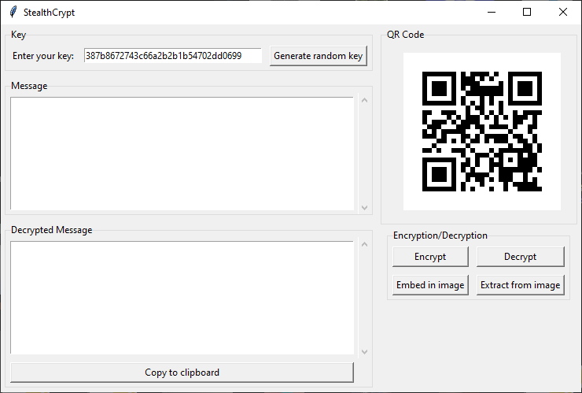

# StealthCrypt
Encrypt and decrypt messages using the AES encryption and Steganography

This code is roughly a 130 lines Python script. (excluding the messy ui code that creates a graphical user interface (GUI) using the tkinter library)

The script allows the user to encrypt and decrypt a message using the AES encryption algorithm from the Cryptodome library. 
it can generate a random key, which is then displayed as a QR code for savekeeping. The user can also embed the encrypted message into an image and extract it from the image.

Here's a breakdown of each section of the code:

1. The necessary libraries are imported at the beginning of the script.

2. The `generate_random_key` function generates a random 16-byte key and displays it in the key entry field. It also generates a QR code for the key using the `generate_qr_code` function.

3. The `generate_qr_code` function generates a QR code for the given key string. It checks if the length of the key is valid (16, 24, or 32 bytes) and then creates a QR code image using the qrcode library. The image is then displayed in the QR code frame.

4. The `encrypt_message` function encrypts the message entered by the user using the AES encryption algorithm. It checks if the length of the key is valid and then creates a new AES cipher object with the key and a random nonce. The message is then encrypted using the cipher object and the resulting cipher text is returned. If the `save_to_file` parameter is set to True, the encrypted message is saved to a file using the `filedialog` library.

5. The `embed_in_image` function embeds the encrypted message into an image selected by the user using the `filedialog` library. It first checks if the image is large enough to contain the data and then modifies the least significant bit of each pixel in the image to contain a bit of the data. The modified image is then saved to a file.

6. The `decrypt_message` function decrypts an encrypted message that has been saved to a file using the `filedialog` library. It checks if the length of the key is valid and then creates a new AES cipher object with the key and the nonce from the encrypted message. The cipher text is then decrypted using the cipher object and the resulting plain text is displayed in the decrypted message frame.

7. The `extract_from_image` function extracts an encrypted message from an image selected by the user using the `filedialog` library. It reads the least significant bit of each pixel in the image to retrieve the data and then decrypts the message using the `decrypt_message` function. The resulting plain text is displayed in the decrypted message frame.

8. The `copy_to_clipboard` function copies the decrypted message to the clipboard using the `clipboard_append` method of the root window.

9. The `on_key_release` and `update_qr_code` functions are used to update the QR code displayed in the QR code frame whenever the user types a new key in the key entry field.

10. The main GUI is created using the tkinter library. The GUI consists of several frames, including a key frame, a message frame, a decrypted message frame, a QR code frame, and an encryption/decryption frame. The encryption/decryption frame contains buttons for encrypting and decrypting messages, as well as buttons for embedding and extracting messages from images. The GUI is displayed using the `mainloop` method of the root window.
